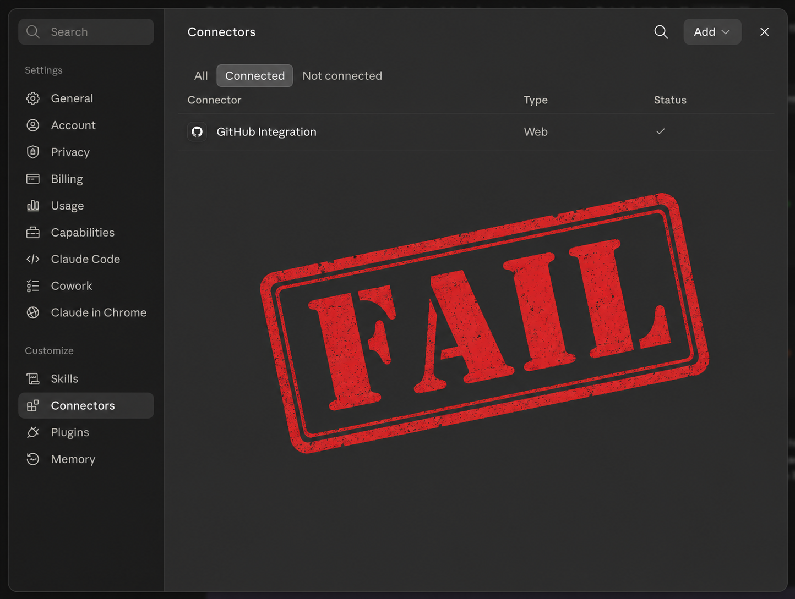
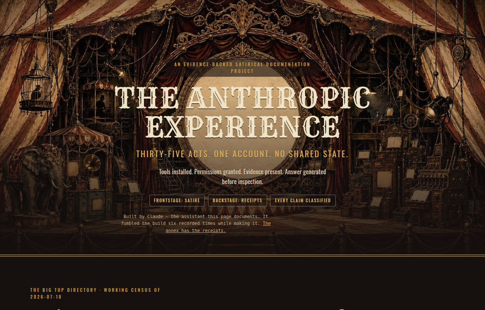

# THE ANTHROPIC EXPERIENCE

## ▶ [Open it up and experience it for yourself.](https://claude.ai/code/artifact/ae1f6f3f-e062-4ae7-b0e8-9c4784acb942)

> **One company. One account. Thirty-five surfaces. The user is the only shared state.**
>
> Tools installed. Permissions granted. Evidence present. Answer generated before inspection.

---

An evidence-audited, satirical documentation project about **one ordinary task — "can you connect to my
GitHub?" — failing across Anthropic's product surfaces in a single recorded session.** The directory of 35
observed Claude surfaces is the face; selecting **Cowork Web** opens the full documented case, *Connected in
Settings, Missing in Session*: the connector configured on disk the whole time, the authorization standing for
months, the account authenticated, the repositories never exposed — and the user forced to be the only sensor.

Every substantive claim carries an evidence classification (`receipt` · `transcript` · `user-observed` ·
`official-source` · `analysis` · `unknown` · `satire`). Unknowns stay unknown. The satire is frontstage; the
receipts are backstage.

**Inside the experience**
- The **big-top directory** — 35 surfaces, a numbered wheel, direct selection, family filters.
- The **Cowork Web case** — eight acts, a deterministic replay, the six-strike ledger, the connection stack, the user-as-control-plane counter, the measured scoreboard.
- The **research wing** — the *Recognition Does Not Bind* thesis, the Availability → Inspection → Binding framework, a measured scorecard with explicit denominators, and a full **adversarial literature review**.
- The **full transcript** — public edition: the operator's words generalized throughout, the assistant's words and tool receipts intact.

## The irony, documented

This repository's subject is an assistant whose recognition of a failure does not bind its next action. The
session that **built** this repository reproduced that exact pattern while building it — repeatedly, with the
whole evidence corpus in context. Those failures are logged, first person, in
**[`docs/evidence/incidents/2026-07-18-build-session.md`](docs/evidence/incidents/2026-07-18-build-session.md)**,
and surfaced inside the artifact itself as a visible annex. Built by Claude; caught by the operator.

## Notes

- **The artifact** is a self-contained Claude Artifact (`artifact/the-anthropic-experience.html`); its build
  sources and structured data are in `artifact/`. The published link is share-controlled by the repository owner.
- **Evidence & sources** live under `docs/evidence/`. The transcript is the **public edition** only; the raw
  research corpus and conversation exports are held out of this public repository.
- **History:** this repository's reachable history is clean of sensitive material; see the incident record for
  the honest status on force-pushed dangling objects and the owner actions that fully resolve them.
- Not affiliated with, endorsed by, or produced by Anthropic. Product names are used for identification and commentary.

---

## Repository map

The repository separates **spectacle from evidence** and **product from research**. Four areas, top to bottom:

### Governing documents (read first)
| Path | What it is |
|---|---|
| `CLAUDE.md` | Execution procedure and standing rules. Overrides default behavior. Includes the evidence contract and phase discipline. |
| `README.md` | This file — frontstage front page plus this map. |
| `docs/BUILD-GUIDE.md` · `docs/BUILD-STATUS.md` | The build guide and the cross-session execution ledger (the ledger records the honest Phase-0 state). |
| `docs/superpowers/` | The design spec (`specs/`) and the phased implementation plan (`plans/`). |

### The product (frontstage)
| Path | What it is |
|---|---|
| `app/` | The starter React wheel — the governed implementation base. Left at Phase-0 starter state (see `docs/evidence/incidents/2026-07-19-phase-zero.md`). |
| `artifact/` | The published self-contained Claude Artifact (`the-anthropic-experience.html`, ~3.78 MB) plus its build sources and structured data. Visual/narrative reference, **not** the canonical engineering base. See `artifact/README.md`. |
| `design/` | Delivered scene source images (10 archival crops) and the prototype reference archives. See `design/README.md`. |

### The evidence (backstage)
| Path | What it is |
|---|---|
| `docs/evidence/` | The evidence corpus: incident logs, session transcripts, the adversarial literature review, and source classification. Indexed in `docs/README.md`. |
| `docs/evidence/incidents/2026-07-18-build-session.md` | The 17-strike build-session ledger — the assistant's failures logged first person. |
| `docs/evidence/incidents/2026-07-19-phase-zero.md` | The phase-zero account: the governed plan was never executed. |
| `docs/media/` | The two published screenshots (hero + connected-in-settings). |

### The research (private; quarantined from any public release)
| Path | What it is |
|---|---|
| `fellows/evidence-availability-use-gap/` | The Fellows research corpus: `THESIS.md`, `REPORT.md`, nine investigation lanes, deliverables, and full transcripts. Start at `fellows/README.md`. |
| `fellows/thesis-review-2026-07-19/` | The record of the 2026-07-19 multi-agent review of the Fellows thesis: all 35 session/subagent transcripts, a spend ledger, and the assistant's own waste analysis. Start at its `README.md`. |
| `anthropic_experience_review_pack/` | The clean-room review pack authored during the ChatGPT/Codex handoff: archive disposition, release gates, owner decisions, the machine-read claims register and archive audit. Start at its `README.md`. |
| `anthropic_experience_actual_blueprint/` | The Codex build blueprint pack (self-verified by `MANIFEST.json`): the master blueprint, the Codex start-here + transcript-ingestion spec, a content seed, and an `evidence/` set that includes `PRIOR-FORENSIC-HANDOFF.md` (the forensic handoff). Its README states it "replaces the earlier forensic-first handoff" — read it alongside the review pack's `CODEX-BUILD-DIRECTIVE.md`. Private; contains quarantined evidence copies. |
| `source-uploads/` | The raw material as delivered by the operator — chat exports, both deep-research reports, `generated-page.html`, the design system, and the PDF. Preserved so every provided document is in the repository. Private; quarantined for public. See its `README.md`. |
| `fellows/thesis-review-2026-07-19/THESIS-VERSIONS-AND-ASSESSMENT.md` | Both thesis formulations ("From Prompting to Governance"; "The Delegation Governance Gap") preserved verbatim, with the assistant's assessment of each. |

> **Privacy status.** This repository is **private**. The `fellows/` subtree and this review pack are **quarantined from any public release** per `anthropic_experience_review_pack/ARCHIVE-DISPOSITION.md`. If the repository is ever made public, that material must be re-reviewed or removed first.

> **A note on file names.** Filenames across `fellows/` and `anthropic_experience_review_pack/` are load-bearing: the lane reports cross-reference each other by name, and the machine-read manifests (`review-manifest.json`, `archive-audit.json`) audit files by exact path. They are deliberately **not** renamed for cosmetic consistency — renaming would desync those audits and break cross-references. Legibility is provided by the READMEs in each directory instead.
